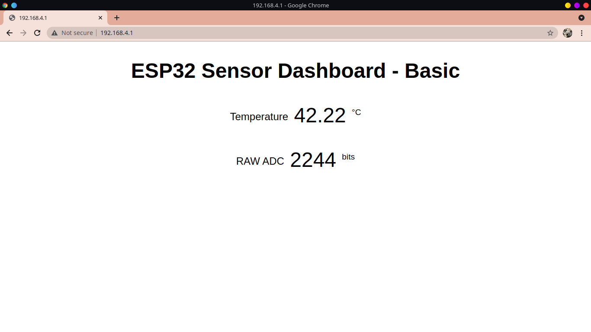

# esp32-multitask

This is basic repo to test out multi-thread, multicore handling by RTOS core.

The code sets up 4 Tasks, namely led blink, ADC read and convert function, WiFi softAP, AsyncWebServer. Also 2 queues are setup to pass data globally.

Code framework: IDF & Arduino Mix

Separate code for arduino-ide added for ease of use; libraries used are included as zip folder.

## settings for platform-io

No special config required, direct run command or program can be executed.
To play around with the config, experiment with platformio.ini file.

## settings for arduino

 - BOARD: ESP32 Dev Module
 - Upload Speed: 921600
 - CPU Frequency: 240MHz (WiFi/BT)
 - Flash Frequency: 80MHz
 - Flash Mode: QIO
 - Partition Scheme: Default 4MB with SPIFFS
 - Core Debug Level: Verbose
 - PSRAM: Disabled

## esp32-setup (post firmware flash)

 - Normal power up.
    - scan for "espmulti" hotspot (passkey is same)

 - Usb connection to a PC
    - Set baud 115200
    - Reset the board
    - note the IP displayed
    - open a web-browser on device connected to "espmulti"
    - enter the IP address as read on serial console

## errata

 - IP is not static has to be checked on serial port while boot up.
 - Stack sizes are not calculated but evaluted as rough estimate
 - Newer versions of ESP32-WROOM module don't have internal temprature sensor populated, thus read value is random noise